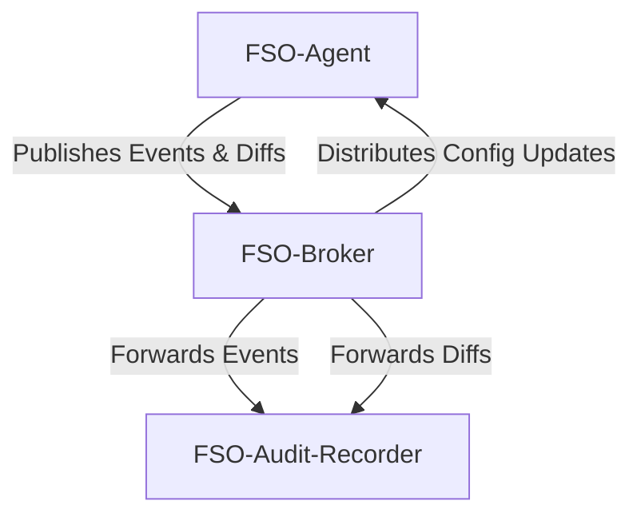

# FSO - File System Observer

FSO (File System Observer) is a Python-based tool designed to monitor and record changes within a user's filesystem. The project aims to provide detailed insights into file modifications by keeping track of when files are changed and sharing this information via a messaging system.

FSO consists of the following components:
- **FSO-Agent**: Observes the filesystem for changes and publishes events to the FSO-Broker. Additionally, it can send diffs of important files attached to the event messages.
- **FSO-Broker**: A message broker responsible for handling communication between the different components.
- **FSO-Audit-Recorder**: Logs the change events received from the FSO-Agents into a file for audit purposes.

This modular architecture allows FSO to be flexible, configurable, and suitable for a variety of monitoring and logging needs.

## System Architecture

The following diagram shows the relationships and message flows between the components of FSO:




## Component Details

### FSO-Agent

The FSO-Agent is responsible for monitoring the filesystem for changes. It uses file monitoring libraries (pythons watchdog in our case) to detect events such as

- file creation
- file modification
- file deletion
- file moving

When an event occurs, the agent performs the following tasks:

- Filtering: Checking if the file is monitored. Using a filter pattern in the configuration, the agent can ignore _private_ files.
- File Diffs: If the file is marked as "important," the agent generates a diff of the file's content (if applicable) and sends it to a dedicated topic on the broker.
- Event Publishing: Sends information about the detected change to the FSO-Broker.

The agent's behavior is configurable, allowing users to specify:

- The directories to monitor.
- File patterns to exclude.
- File pattern to additionally track diffs.
- The types of events to track.

The configuration is currently configured statically, but future versions could allow a remote update of the configuration easily. This configuration update could also be done using the message broker on a separate control-topic.

An installation as systemd service is possible, but not necessary.

[](https://asciinema.org/a/rmFQhvb6gpxfAX6ru3pSVnHKW)

### FSO-Broker

The FSO-Broker acts as a centralized message broker facilitating communication between the components. It handles:

- Event and Diff Forwarding: Routes filesystem change events and diffs from the FSO-Agent to the appropriate consumers.
- Configuration Updates: Distributes configuration updates from the FSO-Controller to the relevant FSO-Agents.

More information about specific details and usage instructions about the broker can be found in the broker README.


[](https://asciinema.org/a/35ENrRRgU9S8zkffnvYoYI5pp)

### FSO-Audit-Recorder

The FSO-Audit-Recorder is responsible for persisting change events and file diffs in a log format. It listens to the FSO-Broker and processes incoming messages by:

- Logging the details of each change event, including:
    - Timestamp of event arrived at agent
    - Timestamp of event emitted by agent
    - File path.
    - Type of change (e.g., create, modify, delete).
- Storing file diffs (if available) for further analysis or debugging.

The audit recorder ensures that all events are safely stored, making it suitable for compliance and auditing purposes.

[](https://asciinema.org/a/MvetaqIClgUjCkygowKkfDfPL)


# Discussion

## Why We Avoid Using Broker Topics for _Important_ and _Secret_ Files

The challenge description suggested solving the problem of distinguishing between _important_ and _secret_ files using broker topics and filters. However, I decided against this approach, even though it could have simplified implementation.

The primary reason is that **secret files should never leave the producer**. If they arrive at the broker, potentially unwanted consumers might access them. To mitigate this risk, these files are filtered out in the agent using configurable filter patterns. Similarly, the diff functionality only sends diffs when necessary, consolidating them into a single message for efficiency.

---

### Issues with the Broker: Message Order and Guaranteed Delivery

The broker cannot guarantee the order of message delivery due to the absence of a queuing mechanism and the possibility of network delays or congestion. To mitigate this, each message includes two timestamps, where the producer's timestamp helps account for network delays.

For production scenarios, consider using an alternative broker. Options include:

- **MQTT-based solutions** for lightweight applications.
- **RabbitMQ** for robust queuing and routing.
- **Apache Kafka** for advanced features like:
  - Ordered message delivery.
  - Exactly-once delivery.
  - Distributed data stream processing.

In particular, Apache Kafka is well-suited for analyzing audit logs of file changes, as required in this project.

---

## Assumptions

- Files are **text-based**. Diffing binary files would require more complex methods.
- Configurations are **hardcoded** to simplify the demonstration.

---

## Weak Points and Potential Improvements

### 1. **Missing Authentication**
   - **Issue**: No authorization or authentication mechanism is implemented.
   - **Proposed Solution**: TBD.

### 2. **No Encryption / TLS**
   - **Issue**: No encryption is used during transport.
   - **Proposed Solution**: Implement TLS or a similar encryption mechanism.

### 3. **Inefficient Message Encoding**
   - **Issue**: Base64-encoded JSON is simple but inefficient for large diffs.
   - **Proposed Solution**: Use more efficient formats like **Avro** or **Protobuf**.

### 4. **Caching**
   - **Current Behavior**:
     - Caching in the agent happens in memory. This is
     - A full copy of each file is stored in memory, leading to inefficiency.
     - No persistence: On startup, the configuration is loaded, and files are indexed. The cache is populated only after the agent starts listening for changes.
   - **Proposed Improvements**:
     - Introduce persistent caching.
     - Optimize memory usage by only storing diffs or critical metadata.

### 5. **User Permissions in FSO-Agent**
   - **Current Behavior**:
     - The systemd service runs as `root` by default when installed via the provided script.
     - This setup may be necessary for monitoring system files but not for all use cases.
   - **Proposed Solution**:
     - Customize the systemd service file to define user permissions:
       ```bash
       USER=myusername
       GROUP=mygroupname
       ```

---

This documentation reflects the current state of the project, highlighting its limitations and offering potential solutions for future iterations.
