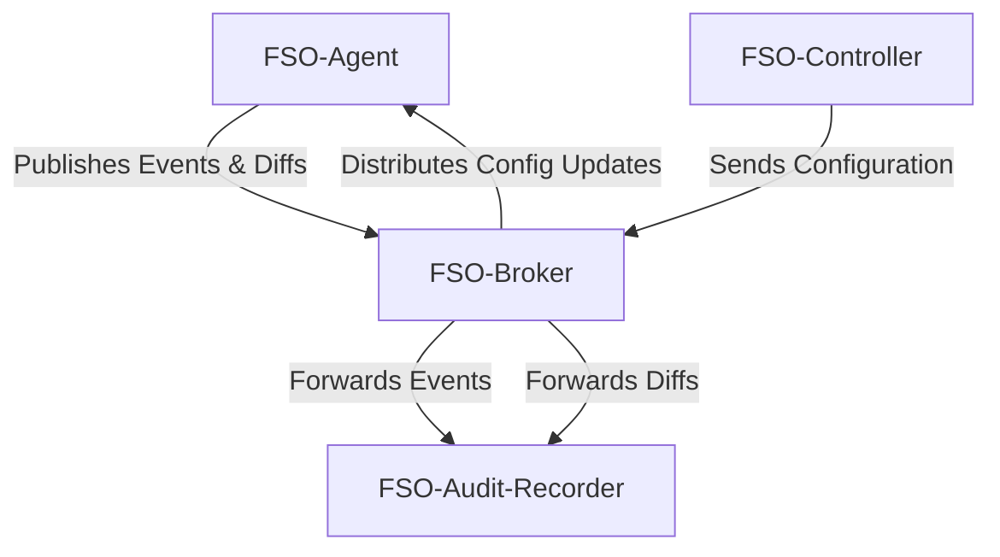

# FSO - File System Observer

FSO (File System Observer) is a Python-based tool designed to monitor and record changes within a user's filesystem. The project aims to provide detailed insights into file modifications by keeping track of when files are changed and sharing this information via a messaging system.

FSO consists of the following components:
- **FSO-Agent**: Observes the filesystem for changes and publishes events to the FSO-Broker. Additionally, it can send diffs of important files to a dedicated topic on the broker.
- **FSO-Broker**: A message broker responsible for handling communication between the different components.
- **FSO-Controller**: Sends configuration updates to FSO-Agents, specifying which directories and file patterns to monitor.
- **FSO-Audit-Recorder**: Logs the change events received from the FSO-Agents into a file for audit purposes.

This modular architecture allows FSO to be flexible, configurable, and suitable for a variety of monitoring and logging needs.

## System Architecture

The following diagram shows the relationships and message flows between the components of FSO:

## Component Details

### FSO-Agent

The FSO-Agent is responsible for monitoring the filesystem for changes. It uses file monitoring libraries (pythons watchdog in our case) to detect events such as file creation, modification, deletion, or renaming. When an event occurs, the agent performs the following tasks:

- Event Publishing: Sends information about the detected change to the FSO-Broker.
- File Diffs: If the file is marked as "important," the agent generates a diff of the file's content (if applicable) and sends it to a dedicated topic on the broker.

The agent's behavior is configurable, allowing users to specify:

- The directories to monitor.
- File patterns to include or exclude.
- The types of events to track.

### FSO-Broker

The FSO-Broker acts as a centralized message broker facilitating communication between the components. It handles:

- Event and Diff Forwarding: Routes filesystem change events and diffs from the FSO-Agent to the appropriate consumers.
- Configuration Updates: Distributes configuration updates from the FSO-Controller to the relevant FSO-Agents.

The broker can be implemented using a lightweight message queue like RabbitMQ, Kafka, or even an MQTT broker, depending on system requirements.

### FSO-Controller

The FSO-Controller provides centralized management for FSO-Agents. Its primary function is to send configuration updates to agents, specifying:

- Which directories and file patterns they should monitor.
- Any additional rules or thresholds for monitoring.

This allows for dynamic reconfiguration of agents without needing to restart them. The controller communicates with the FSO-Broker, which relays these updates to the agents.

### FSO-Audit-Recorder

The FSO-Audit-Recorder is responsible for persisting change events and file diffs in a log format. It listens to the FSO-Broker and processes incoming messages by:

- Logging the details of each change event, including:
    - Timestamp.
    - File path.
    - Type of change (e.g., create, modify, delete).
- Storing file diffs (if available) for further analysis or debugging.

The audit recorder ensures that all events are safely stored, making it suitable for compliance and auditing purposes.

# Notes

Remember,, this is a demo project. In real-world scenarios, you would want to use a more advanced message broker. The system has multiple shortcomings. To name a few:
- scalability
- security
- ...

# Project structure

This project is configured as a monorepo. We are using poetry as our package manager of choice.
